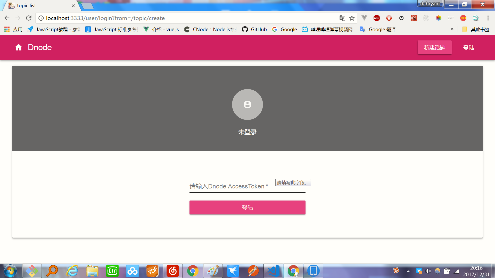

# 技术栈

```
react + mobx + react-router4 + webapck3 + axios + material-ui + express + ejs + cnode Api
```


# 项目介绍

本项目学习于慕课网，实现了cnode社区大部分功能，实现了前端和服务端双重渲染,ui界面使用了material-ui这个库，ui真的很赞；状态管理用到了mbox，声明式编程真的很爽，比起redux用的舒服，不过两种各有优缺点，看实际情况使用；获取数据用到了cnode api，并用axios进行了一些简单的代理封装；服务端渲染用到了node，ejs作为模板，路由切换用到了react router v4，v4也是声明式编程，一旦习惯了v4，用起来也挺好使；项目搭建用到了webpack，并且利用webpack的热更新插件进行实时编程；优化配合使用七牛和webpack，将app.js等等转化为cdn加快了浏览器渲染速度，其他的优化就用到了webpack的几个插件，例如用UglifyJsPlugin将代码压缩，用vendor和webpack的插件CommonsChunkPlugin将第三方库react、react-dom、react-dom-router和整个应用进行分离，当我们需要使用这些依赖的时候，可以从应用程序 bundle中提取 vendor 引用到 vendor bundle，利用这些方法我们将这个app.js从9M压缩到900k，优化效果是显而易见的。
        

# 怎么实现服务端渲染？

以下是主要思路：

```js
const ReactDomServer = require('react-dom/server')
const content = ReactDomServer.renderToString(app)
const html = ejs.render(template,{})
```

利用renderToString将react组件转化成字符串，将react字符串注入模板文件

```js
const template = fs.readFileSync(path.join(__dirname,'../dist/server.ejs'),'utf8')
const serverEntry = require('../dist/server-entry')

```
读取模板文件和服务端入口文件，将服务端返回的内容插入到html里，然后把整个内容返回到浏览器端

其中遇到了一个比较坑的点，我们得在react渲染之前先获取stores这些数据，这个用到了react-async-bootstrapper这个插件。

# 为什么要使用服务端渲染？

1. SEO，让搜索引擎更容易读取页面内容

2. 首屏渲染速度更快（重点），无需等待js文件下载执行的过程

3. 更易于维护，服务端和客户端可以共享某些代码

4. 可以利用session将登陆持久化,这是前端做不到的


# 项目运行

由于我们优化用到了cdn，所以本地项目运行的时候需要在app.config里添加你自己的项目的ak和sk，并且改成你自己的bucket和host

```
git clone
cd react-cnode
cnpm i

npm run deploy //将cdn生成你本人的cdn
npm start      //或者也可以在npm上全局安装pm2,然后pm2 start process.yml

```

# 项目本地运行截图





